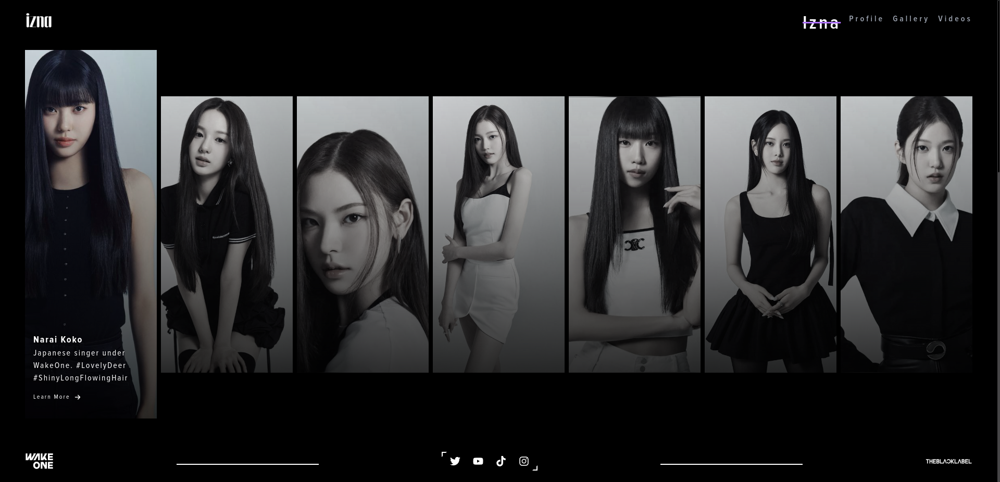

# IZNAYA - The Ultimate Fan Site for IZNA

[](LICENSE)
[](https://iznaya.netlify.app)

Welcome to IZNAYA, the fan project for IZNA! This Next.js application is dedicated to providing IZNA fans (NAYA) with a comprehensive platform to explore the group's music, performances, news, and community.



## Features

- **Group Profile**: Detailed information about IZNA members, including profiles, discography, and achievements.
- **Music Library**: A collection of IZNA's songs, albums, and music videos.
  <!-- - **Performance Archive**: Videos and photos from concerts, variety shows, and other appearances. -->
  <!-- - **News Feed**: Latest updates on IZNA's activities, schedules, and announcements. -->
  <!-- - **Community Forum**: A space for NAYA to discuss, share fan art, and connect with each other. -->
  <!-- - **Merchandise Store**: Official merchandise available for purchase. -->
- **Many more coming up**

## Getting Started

1. Clone the repository:

```shell
git clone https://github.com/pushpa1105/naya.git
```

2. Install dependencies:

```shell
npm install
```

3. Start the development server:

```shell
npm run dev
```

4. Open [http://localhost:3000](http://localhost:3000) with your browser to see the result.

## License

Distributed under the MIT License. See [LICENSE](LICENSE) for more information.

Additionally, please note:

1. This is an unofficial fan site and is not affiliated with or endorsed by IZNA or their management.
2. All rights to IZNA's music, images, and other creative works remain with their rightful owners.
3. Commercial use of any content from this site is strictly prohibited without explicit permission from the copyright holders.
4. By using this site, you agree to these terms and acknowledge that you will not use any content for commercial purposes.

## Acknowledgments

- Special thanks to IZNA and their management team for creating such amazing music and performances.
- Thanks to all NAYA who contribute to the community and support IZNA.
- Inspiration drawn from various K-pop fan sites and Next.js projects.

## Support

Give a ⭐️ if this project helped you!
